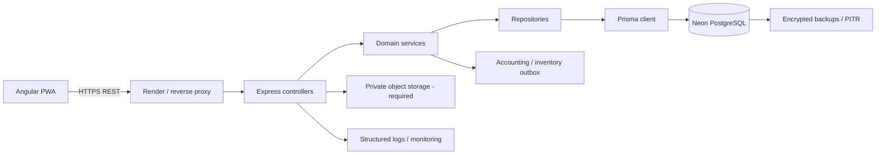
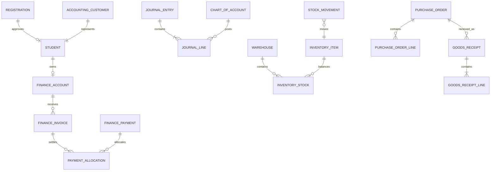

# Architecture

```mermaid
flowchart LR
  Browser[Angular PWA] -->|HTTPS REST| Proxy[Render / reverse proxy]
  Proxy --> API[Express controllers]
  API --> Services[Domain services]
  Services --> Repositories[Repositories]
  Repositories --> Prisma[Prisma client]
  Prisma --> Neon[(Neon PostgreSQL)]
  Services --> Events[Accounting / inventory outbox]
  API --> Files[Private object storage - required]
  API --> Logs[Structured logs / monitoring]
  Neon --> Backups[Encrypted backups / PITR]
```

```mermaid
erDiagram
  REGISTRATION ||--o| STUDENT : approves
  STUDENT ||--o| FINANCE_ACCOUNT : owns
  FINANCE_ACCOUNT ||--o{ FINANCE_INVOICE : receives
  FINANCE_INVOICE ||--o{ PAYMENT_ALLOCATION : settles
  FINANCE_PAYMENT ||--o{ PAYMENT_ALLOCATION : allocates
  JOURNAL_ENTRY ||--|{ JOURNAL_LINE : contains
  CHART_OF_ACCOUNT ||--o{ JOURNAL_LINE : posts
  ACCOUNTING_CUSTOMER ||--|| STUDENT : represents
  WAREHOUSE ||--o{ INVENTORY_STOCK : contains
  INVENTORY_ITEM ||--o{ INVENTORY_STOCK : balances
  PURCHASE_ORDER ||--o{ PURCHASE_ORDER_LINE : contains
  PURCHASE_ORDER ||--o{ GOODS_RECEIPT : received_as
  GOODS_RECEIPT ||--|{ GOODS_RECEIPT_LINE : contains
  STOCK_MOVEMENT }o--|| INVENTORY_ITEM : moves
```

The production target is one PostgreSQL persistence driver. SQLite remains a temporary rollback/default path and must be removed after evidence-based cutover approval.
