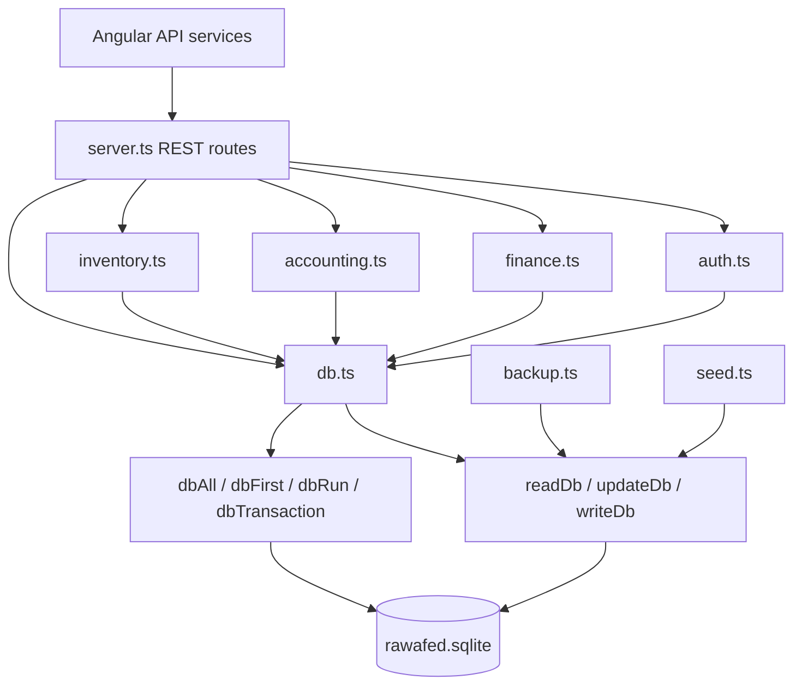

# PostgreSQL migration plan

## Safety rule

Do not remove `sql.js`, change the Render start command, or point production traffic at PostgreSQL until Phase 3 passes. The current REST handlers are synchronous and still use the legacy adapter; Prisma is asynchronous. A compatibility shim that reads the entire database and rewrites it would preserve the original consistency defect, so it is intentionally not used.

## Dependency graph

### Collection persistence callers

| Area | Reads | Writes | Data affected |
|---|---|---|---|
| `server.ts` | `readDb` | `updateDb`, `logAudit` | auth, users, registrations, students, notifications, uploads, finance, staff, settings |
| `accounting.ts` | `readDb`, `dbAll`, `dbFirst` | `dbRun`, `dbTransaction` | chart of accounts, journals, receivables, payables, cash, bank, suppliers |
| `inventory.ts` | `readDb`, `dbAll`, `dbFirst` | `updateDb`, `dbRun`, `dbTransaction` | inventory, purchasing, receipts, invoice bridge |
| `finance.ts` | in-memory `DatabaseShape` | mutates finance account collection | registration finance accounts |
| `seed.ts` | — | `updateDb` | users and defaults |
| `backup.ts` | `readDb` | filesystem JSON | full database export |

`db.ts` owns all `replace*` functions and SQL.js initialization. There are no direct SQL.js imports elsewhere.

## Phases and gates

### Phase 1 — PostgreSQL foundation (implemented)

- Prisma/PostgreSQL schema with normalized invoices, allocations, payments, VAT, chart of accounts, and journals.
- Generated initial migration and idempotent seed.
- Central Prisma client and strict environment schema.
- Legacy import/validation/report utility.
- Gate: `npm run build`, `npm test`, and `npm run db:validate` pass.

### Phase 2 — repositories and services

- Add repositories by bounded context: identity, admissions, finance, accounting, inventory, notifications, files, settings.
- Move business rules from route callbacks into services; controllers only translate HTTP DTOs.
- Add Zod request validators and centralized typed errors.
- Preserve every existing route and response envelope.
- Replace registration approval with one interactive Prisma transaction creating the Student, FinanceAccount, Notification, and AuditLog.
- Gate: API contract tests run against both the legacy baseline and PostgreSQL and produce identical status codes/response shapes.

### Phase 3 — financial and inventory cutover

- Replace every generic SQLite query in `accounting.ts` and `inventory.ts` with repository calls.
- Post invoices as debit Accounts Receivable / credit Revenue and VAT Payable.
- Post payments as debit Cash or Bank / credit Accounts Receivable; never credit Revenue.
- Derive balances from journal lines and payment allocations; remove stored `paid`, `remaining`, and dashboard totals.
- Enforce balanced entries in the journal service before commit.
- Gate: finance integration tests, trial balance equality, duplicate-source tests, N+1 query review, and migration rehearsal pass.

### Phase 4 — migration rehearsal and production cutover

1. Put the legacy API into maintenance/read-only mode.
2. Take a backup and run `npm run db:legacy:migrate -- --source=<backup.json> --report=<report.json>`.
3. Require a successful report and manually reconcile control totals.
4. Deploy with `npm run db:migrate`, then seed reference data.
5. Run health, auth, registration, approval, invoice, payment, expense, notification, and ledger smoke tests.
6. Switch traffic; retain the immutable SQLite backup for rollback.

### Phase 5 — removal

- Remove `src/db.ts`, `sql.js`, `@types/sql.js`, JSON backup persistence, `readDb`, `updateDb`, `writeDb`, every `replace*`, and the old seed.
- Gate: `rg 'readDb|updateDb|writeDb|dbRun|dbAll|dbFirst|sql\\.js' src` returns no results and the full suite passes.

## Required test matrix

Unit tests cover validators, invoice math, VAT separation, payment allocation, journal balancing, and authorization. Integration tests cover authentication/refresh/revocation; registration and atomic approval; student/account creation; invoice/payment/expense journal posting; audit/notification creation; rollback injection; pagination; and migration duplicate/FK/count checks. API contract tests snapshot the Angular-visible endpoints before and after cutover.
